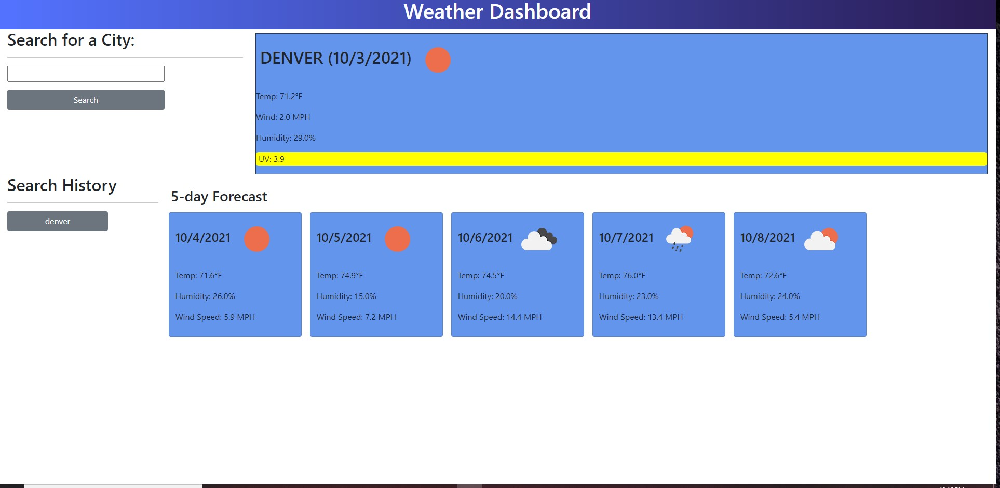

## Purpose: searching weather

### Description: 
This application allows to:
* display current date and weather dining on the city or country search.
* When the user enters the city/ country name, the app will display current weather temperature, humidity, and UV index.
* Also, the app provides five future days forecasts.
* Under history search, the city buttons will be added depending on the search the user made.
* When the user refreshes the page, all history searches will be shown on the screen.
* When the user press on the history city name, the app will display the current and five days forecast. 

## Instructions:
The user should enter the city name in the input text then press on the search to get the results
as  following snips:

## Website
 https://ghaliarose89.github.io/weather-search/

### Contribution
Made with ❤️️ by Ghalia

### ©️ [2021] [Ghalia Sami]# weather-search